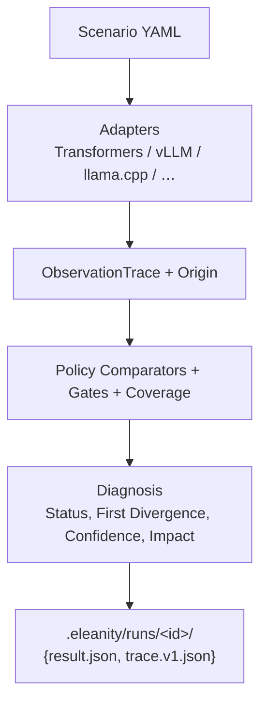

# Eleanity

### Same model. Same input. Find the **first** causal divergence.

[](https://github.com/TheusHen/eleanity/actions/workflows/ci.yml)
[](https://github.com/TheusHen/eleanity/actions/workflows/parity-local-ai.yml)
[](https://www.python.org/downloads/)
[](LICENSE)
[](#why-cli-only)

**Eleanity is a local-first CLI that tells you *where* two LLM runtimes of the same model started lying to each other** — chat template, tokenizer, token IDs, generation, API shape — with **coverage**, **confidence**, and a **reproducible command**.

It does **not** tell you if the model is “smart”.  
It tells you if **vLLM / Transformers / llama.cpp / LM Studio / OpenAI-compat** still produce the **same causal path** for the same scenario.

```text
$ eleanity compare --model HuggingFaceTB/SmolLM2-135M-Instruct \
    --backends transformers,transformers --format quiet --no-gates

status=PASS impact=NONE coverage=100.0 confidence=0.85
first_divergence=none gates=True
run_id=0aba046a-5846-45b2-94d9-4584bb4fe98a
```

> **Real run on this machine** (CPU, cached HF weights):  
> pull tokenizer ~11s · full self-parity compare ~14s wall / **~10.3s** engine · template+tokens **PASS** · generation **PASS** · coverage **100%**.

If that line looks useful for your monorepo, CI, or runtime migration — **star the repo** so more platform teams find it.

---

## Why this exists

Shipping an LLM is no longer “one Python process”.  
It’s **Transformers → vLLM**, **full precision → Q8**, **HF id → LM Studio id**, **template flag off by one newline**.

Most teams discover that with:

| Approach | What you get | What’s missing |
| --- | --- | --- |
| Manual `print(output)` | vibes | no layer, no location, no CI contract |
| Golden string tests | brittle diffs | not causal (why / where) |
| lm-eval / MMLU | quality scores | **not** runtime parity |
| Generic “LLM proxy” dashboards | latency/cost | not first divergence |
| Ad-hoc notebooks | one-off truth | not reproducible in CI |
| **Eleanity** | **first divergent layer + coverage + exit codes** | focused on parity only |

Eleanity is the **diff tool for inference stacks**, not a benchmark suite.

---

## 60-second demo (no GPU, no model download)

```bash
uv sync --group dev
uv run eleanity doctor --format json
uv run eleanity compare --model demo --backends fake,fake --format quiet --no-parallel --no-gates
```

### Exact output (live run)

```text
$ uv run eleanity compare --model demo --backends fake,fake --format quiet --no-parallel --no-gates

status=PASS impact=NONE coverage=100.0 confidence=0.85 first_divergence=none gates=True run_id=16c3f05b-70f9-4c6a-9170-3e5942f91bd6
```

JSON summary from the same path:

```json
{
  "status": "PASS",
  "impact": "NONE",
  "coverage_percent": 100.0,
  "confidence": 0.85,
  "first_divergence": null,
  "gates_passed": true,
  "verified_layers": [
    "artifact",
    "template",
    "tokens",
    "generation",
    "special_tokens"
  ]
}
```

**What this proves in seconds:**

- install is one command  
- machine-readable one-liner for CI  
- honest **coverage** (not a silent skip)  
- **confidence** on the diagnosis  
- dual axis: **parity status** + **functional impact**

Self-consistency probe:

```text
$ uv run eleanity stabilize --backend fake --model demo --repetitions 3 --format quiet

backend=fake rate=1.0 self_consistent=True
# ~4.4s for 3 self-pairs on this machine
```

---

## Real model demo (tiny HF model, CPU)

This is the “show me it works” path. Model: **`HuggingFaceTB/SmolLM2-135M-Instruct`** (~135M params).

### Stage 1 — environment

```bash
uv sync --group dev --extra transformers
uv run eleanity doctor --format json
```

### Stage 2 — pull (tokenizer path)

```bash
$ uv run eleanity pull HuggingFaceTB/SmolLM2-135M-Instruct --tokenizer-only
```

Exact response (cached run):

```json
{
  "model_id": "HuggingFaceTB/SmolLM2-135M-Instruct",
  "revision": "main",
  "tokenizer_only": true,
  "tokenizer_loadable": true,
  "trust_remote_code": false
}
```

```text
# wall time on this machine (already cached): ~11.2s
```

### Stage 3 — compare Transformers × Transformers

```bash
$ uv run eleanity compare \
    --model HuggingFaceTB/SmolLM2-135M-Instruct \
    --backends transformers,transformers \
    --format quiet \
    --no-parallel \
    --no-gates \
    --observe artifact,template,special_tokens,tokens,generation
```

**Exact quiet line (real run):**

```text
status=PASS impact=NONE coverage=100.0 confidence=0.85 first_divergence=none gates=True run_id=0aba046a-5846-45b2-94d9-4584bb4fe98a
```

```text
# engine total_ms ≈ 10275.5
# wall clock ≈ 13.9s (includes process startup + weight load)
# second observation is warm: ~1.0s vs ~9.3s first pass
```

### Stage 4 — human report

```bash
$ uv run eleanity report 0aba046a-5846-45b2-94d9-4584bb4fe98a --format text
```

**Exact highlights from that report:**

```text
run_id:     0aba046a-5846-45b2-94d9-4584bb4fe98a
policy:     strict
baseline:   transformers

Layer            Baseline obs   Candidate obs   Compare
artifact         OBSERVED       OBSERVED        PASS
special_tokens   OBSERVED       OBSERVED        PASS
template         OBSERVED       OBSERVED        PASS
tokens           OBSERVED       OBSERVED        PASS
generation       OBSERVED       OBSERVED        PASS

Coverage
  required:  100.0% (min 75.0%)
  requested: 100.0%

Verified
  artifact, template, tokens, generation, special_tokens

Not verified
  —

Diagnosis · PASS · confidence=85%
  No divergence found on mutually comparable layers.

Template diff
  result: PASS

Token diff
  result: PASS
  count: 31 (match)

Gates
  [OK] min-coverage: required-layer coverage 100.0% (min 75%)
  [OK] default-diagnosis: ...

Timings
  transformers:    9258.8 ms (90.1%)
  transformers#2:  1016.8 ms ( 9.9%)
  total:          10275.53 ms
  delta: transformers#2 is -89.0% vs transformers

Reproduce
  eleanity compare --model HuggingFaceTB/SmolLM2-135M-Instruct \
    --backends transformers,transformers --baseline transformers \
    --policy strict \
    --observe artifact,template,special_tokens,tokens,generation \
    --no-gates --name compare --format text
```

### Stage 5 — CI one-liner

```bash
eleanity compare --model HuggingFaceTB/SmolLM2-135M-Instruct \
  --backends transformers,transformers --format quiet --no-gates
# exit 0 on PASS / PASS_WITH_TOLERANCE / PASS_WITH_LIMITED_COVERAGE (unless gates fail)
# exit 1 on DIVERGENT
# exit 2 on config / missing deps
```

---

## What makes it different (and star-worthy)

### 1. Causal, not cosmetic
Other tools stop at “outputs differ”.  
Eleanity walks layers in order:

`artifact → template → special_tokens → tokens → logits → generation → structured → api`

…and reports **first divergence** with location (char/byte/token index when available).

### 2. Honest about missing data
Missing observations never become silent PASS.

| Observation state | Meaning |
| --- | --- |
| `OBSERVED` | both sides measured |
| `NOT_EXPOSED` / `NOT_SUPPORTED` | backend can’t show the layer |
| `NOT_REQUESTED` | scenario didn’t ask |

| Comparison status | Meaning |
| --- | --- |
| `PASS` | required layers match |
| `PASS_WITH_TOLERANCE` | within declared numeric/prefix policy |
| `PASS_WITH_LIMITED_COVERAGE` | green-ish but incomplete evidence |
| `INCONCLUSIVE` | not enough mutual observation |
| `DIVERGENT` | hard mismatch |
| `ERROR` | failed to run |

Every report shows **Verified** / **Not verified**, **coverage %**, and **confidence**.

### 3. Built for operators
- Exit codes for GitHub Actions / GitLab  
- `quiet` for bots, `text` for humans, `json` for pipelines, `sarif` for code scanning  
- `replay <run_id>`, `stabilize`, `migrate`, `promote`, `vendor-check`, golden regression  
- Full **reproduction command** stored on every run  

### 4. Fast enough for daily loops
| Workload | Observed on this machine |
| --- | --- |
| offline fake self-parity | ~2–3s |
| stabilize ×3 (fake) | ~4.4s |
| SmolLM2-135M self-parity (CPU, cached) | ~10–14s |
| warm second observation | ~1s |

That’s “run it on every PR with a tiny model” territory — not “wait for overnight eval”.

### 5. Policies you can argue about in a design review

```bash
eleanity policy-spec --policy quantized --format quiet
# artifact=exact chat_template=exact ... prefill_logits=numerical
# generated_token_ids=prefix finish_reason=exact
```

`strict` for tokenizer CI.  
`quantized` for Q8 vs bf16.  
`functional` / `api_conformance` for tools & HTTP shape.

---

## Install

```bash
# core CLI
uv sync --group dev

# optional local HF backend
uv sync --extra transformers
```

Requires **Python 3.11+**.

---

## Everyday commands

```bash
# environment check
eleanity doctor --check-backends --format json

# main path
eleanity compare --backends transformers,vllm --format text

# suites / CI
eleanity test fixtures/public/tokenizer-edge.yaml --backends fake,fake --format quiet
eleanity ci --baseline M1 --candidate M2 --backend transformers --format quiet

# product flows
eleanity migrate --from transformers --to vllm --model org/model
eleanity promote --baseline full --candidate quant --backend transformers --policy quantized
eleanity vendor-check --endpoint http://127.0.0.1:8000 --model vendor-id

# history
eleanity runs ls --format quiet
eleanity report <run-id> --format text
eleanity replay <run-id>
```

Full reference: [docs/cli.md](docs/cli.md)

---

## Why CLI only?

Eleanity is intentionally **not** a shareable HTML dashboard product.

Supported operator I/O:

| Format | Audience |
| --- | --- |
| `text` | humans in the terminal |
| `json` | automation |
| `quiet` | one-line CI |
| `sarif` | security / code scanning |

That keeps the tool **local-first**, **scriptable**, and **honest** in logs — the properties that win stars from engineers, not screenshots from demos that hide missing layers.

---

## Architecture




Deep dives:

- [docs/parity-specification.md](docs/parity-specification.md)  
- [docs/trace-specification.md](docs/trace-specification.md)  
- [docs/execution-capsule.md](docs/execution-capsule.md)  
- [docs/evaluation-assessment.md](docs/evaluation-assessment.md)  

---

## CI that actually runs models

GitHub Actions ship with the repo:

| Workflow | What it does |
| --- | --- |
| `ci.yml` | lint · unit · contract · CLI smoke |
| `parity-local-ai.yml` | **downloads SmolLM2-135M** · real transformers self-parity · uploads `values.json` |
| `parity-public-fixtures.yml` | public scenario suites |
| `eleanity.yml` | reusable monorepo gate |

Local AI helper:

```bash
# Linux/macOS
ELEANITY_CI_MODEL=HuggingFaceTB/SmolLM2-135M-Instruct \
  bash scripts/ci/run_local_ai_parity.sh

# Windows
.\scripts\ci\run_local_ai_parity.ps1
```

---

## Adapters

`transformers` · `vllm` (HTTP + optional embedded) · `llamacpp` · `ollama` · `sglang` · `tgi` · `openai` · `fake`

HTTP backends stay honest when they cannot expose templates/logits — those layers show as **Not verified**, not fake PASS.

---

## Contributing

```bash
uv sync --group dev
uv run ruff check src tests
uv run ruff format --check src tests
uv run pytest -q
```

See [CONTRIBUTING.md](CONTRIBUTING.md). Issues and PRs welcome — especially new adapters, fixtures, and diagnosis rules.

---

## Star this if you care about runtime truth

If you:

- migrate **Transformers → vLLM / SGLang / llama.cpp**  
- ship **quantized** models and need a non-vibes gate  
- own **platform CI** for LLM services  
- are tired of “it works on my notebook”

…**Eleanity is for you.**

**Star the repo**, run the 60-second demo, drop a issue with your stack (model + backends). The more real stacks we support, the more this becomes the default parity tool for the ecosystem.

```bash
uv run eleanity compare --model demo --backends fake,fake --format quiet
# status=PASS coverage=100.0 confidence=0.85
```

---

## License

Apache-2.0 — see [LICENSE](LICENSE).
